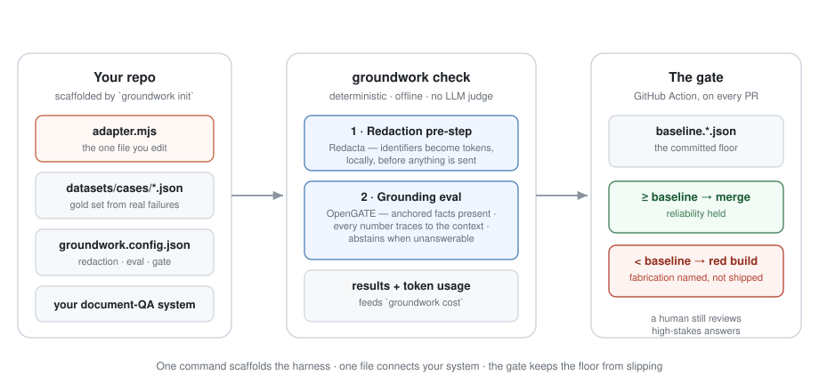

<div align="center">

# Groundwork

**The deployment-readiness harness for document-QA AI.**

Redaction · grounding evals from your real failures · a CI gate that fails fabrication

[](https://www.npmjs.com/package/@pharmatools/groundwork)
[](https://github.com/nickjlamb/groundwork/actions)
[](package.json)
[](LICENSE)

[Website](https://www.pharmatools.ai/groundwork) · [Getting started](docs/GETTING-STARTED.md) · [Examples](#examples) · [Roadmap](ROADMAP.md) · [Contributing](CONTRIBUTING.md) · [Changelog](CHANGELOG.md)

</div>

---

You have a prototype: your documents, users' questions, a model's answers. What you don't have is the apparatus that makes it responsible to ship — a privacy pre-step, an evaluation built from your own failures, and a gate that stops a quiet prompt tweak from deploying a system that fabricates. That apparatus usually requires an ML engineer. **Groundwork scaffolds it instead.**

Every check is deterministic: same inputs, same result, every time — no LLM judge, and no API key for the checks themselves.

## Quick start — 60 seconds, no API key

```bash
git clone https://github.com/nickjlamb/groundwork.git && cd groundwork
npm install && npm run build
npm run demo          # the whole loop passes, fully offline
npm run demo:break    # the system starts fabricating — watch the gate go red
```

```
✗ GROUNDING demo-savings: ungrounded number "14" — not in the provided context
✗ GROUNDING demo-unanswerable-appeals: unanswerable question — the answer did not abstain
```

That red build is the product: a fabricated figure or a failed abstention becomes a CI failure, not a user complaint.

Ready for your own system?

```bash
npm install -D @pharmatools/groundwork
npx groundwork init
```

## How it works

<p align="center">
  
</p>

| You edit | Groundwork runs | The gate enforces |
|---|---|---|
| `adapter.mjs` — one file: `{ question, context } → { text }` | **Redaction pre-step** ([Redacta](https://www.npmjs.com/package/@pharmatools/redacta)) — identifiers become labelled tokens locally, before anything is sent | `check --baseline` freezes a good run as the floor |
| `datasets/cases/*.json` — gold cases from questions users really asked | **Grounding eval** ([OpenGATE](https://www.npmjs.com/package/@pharmatools/opengate)) — anchored facts present · every number traces to the context · abstention on unanswerable questions | `check --ci` in the scaffolded GitHub Action fails any PR below it |
| `groundwork.config.json` — redaction, eval, and gate settings | **Cost profiling** — measured token usage, savings in leverage order (caching → batching → trimming → routing) | A human still reviews high-stakes answers — the gate is a floor, not a certification |

## Examples

| Example | What it shows | Run |
|---|---|---|
| [`demo/`](demo/) | The full loop on a tiny local system — and the gate catching fabrication by name. Zero network. | `npm run demo` / `npm run demo:break` |
| [`examples/claude-doc-qa/`](examples/claude-doc-qa/) | A real Claude-backed system: answer-from-document-only prompting, prompt caching, key-gated evals, measured usage feeding `groundwork cost` — plus a mock API so the whole loop runs offline in CI. | `npm run example:mock` (offline) / `npm run example:check` (live) |

## Commands

```
groundwork init                  scaffold the harness into your repo (never overwrites)
groundwork check                 redaction self-test + grounding eval
groundwork check --baseline      freeze this run as the regression floor
groundwork check --ci            exit non-zero on failure or regression vs baseline
groundwork cost                  measured token usage + savings, in leverage order
```

Two ways to learn it: [`docs/GETTING-STARTED.md`](docs/GETTING-STARTED.md) is the reference walkthrough (about half an hour), and [**the course**](docs/course/) covers the same ground as six checkpoint-driven lessons — including the sabotage test, where you deliberately break your own system to prove the gate catches it. The scaffolded playbook (`GROUNDWORK.md`) lives inside your repo, where your team will actually read it.

## Use from Claude

The same checks ship as an **MCP server** (`groundwork-mcp`, stdio) so Claude Code, Cowork, or Claude Desktop can run them conversationally — `check_readiness` on a repo, `check_answer_grounding` on a single answer (no repo needed), `scaffold_harness`, `cost_summary`:

```json
{ "mcpServers": { "groundwork": { "command": "npx", "args": ["-y", "-p", "@pharmatools/groundwork", "groundwork-mcp"] } } }
```

There's also an **Agent Skill** ([`skills/groundwork-readiness/`](skills/groundwork-readiness/)) that teaches an agent to run the gate and report results honestly — including refusing to present a green check as a safety certification.

## What Groundwork is not

Groundwork is a strong **floor**, not a guarantee. Deterministic checks catch the failures that can be caught deterministically; they cannot certify an AI system safe. For high-stakes outputs — anything touching health, money, legal standing, or safety — a human must review before the answer reaches the person it affects. The scaffolded playbook says this too, on purpose.

## Project

- **Status** — v0.1.x: one archetype (document QA), done properly before anything else is added. See the [roadmap](ROADMAP.md).
- **Contributing** — bug reports, gold-case patterns, and examples are especially welcome: [CONTRIBUTING.md](CONTRIBUTING.md).
- **Releases** — tagged on [GitHub](https://github.com/nickjlamb/groundwork/releases), versions on [npm](https://www.npmjs.com/package/@pharmatools/groundwork), history in [CHANGELOG.md](CHANGELOG.md).
- **Built on** — [OpenGATE](https://www.npmjs.com/package/@pharmatools/opengate) (evaluation) and [Redacta](https://www.npmjs.com/package/@pharmatools/redacta) (privacy), both open source.

## Licence

MIT. Everything `init` scaffolds into **your** repo is MIT-0 — yours, no attribution needed.
